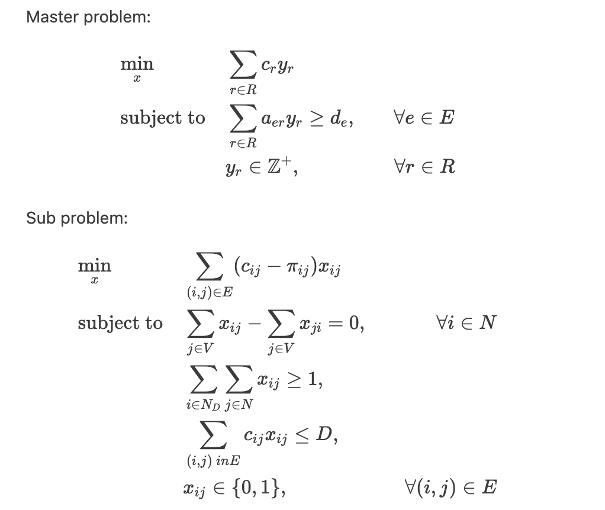

# route-optimization

A national retailer operates a distribution network comprising vendors, distribution centers, and stores. Using historical data, the retailer can estimate the movement of goods (measured in load counts) between each node in the network. The goal of this project is to determine the most efficient routing strategy to fulfill all transportation demands while minimizing costs or travel time.

This is combinatorial optimization problem where computational time grows exponentially with the size of the network. This project employs column generation, a large-scale optimization technique that iteratively genenrates promising routes and efficiently improves the objective function.

<div style="text-align: center;">
  
</div>

### To run some examples
1. To generate inputs:
   ```
   python3 generate_input.py -v 10 -d 5 -s 50
   ```
2. To run optimization
   ```
   python3 main.py
   ```
